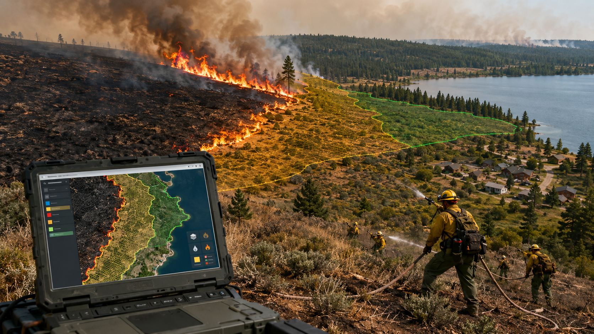
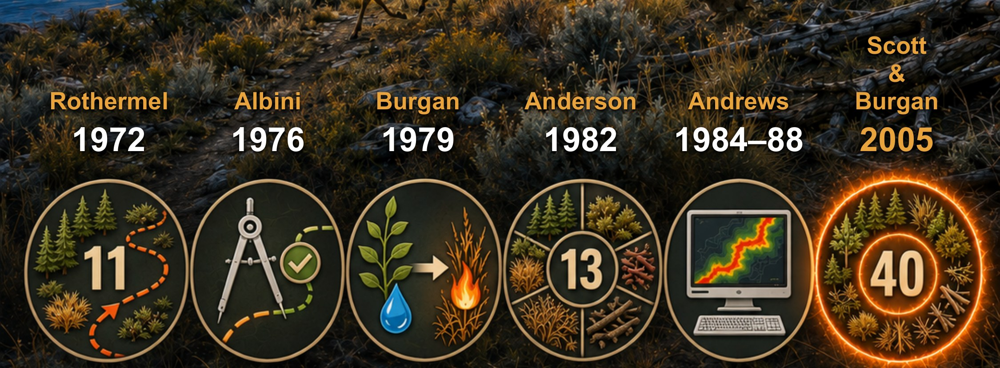

# WildFire Spread Prediction

### Spanning the field from Rothermel's 1972 to AI and PIML.
### Given an active ignition, how and where does it go next. 
### This repo is to store research artifacts on wildfire **spread** such as: notebooks, physics engines, CLI tools and reference material

## Why spread prediction matters

- Accurate fire path estimations is what turns a detection into an actionable response by driving evacuation routing, firebreak placement, and resource allocation.

## From Rothermel's 1972 fire spread equation to Scott & Burgan's 2005

